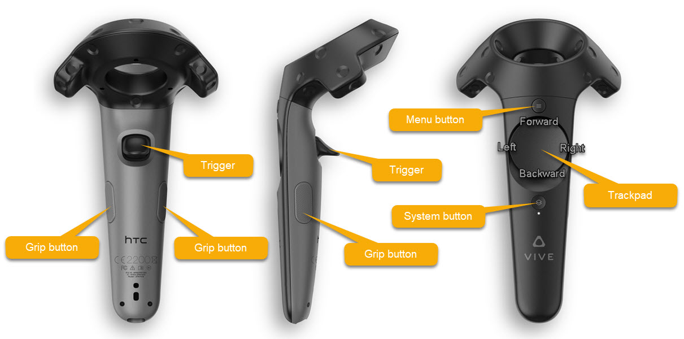

SlicerVirtualReality
====================

Extension for 3D slicer that enables user to interact with the 3D scene using virtual reality.

The extension works with all OpenVR-compatible headsets, such as [HTC Vive](#setup-htc-vive), all [Windows Mixed Reality headsets](#setup-windows-mixed-reality) (by Acer, Lenovo, HP, etc.), and with [Oculus Rift](#setup-oculus-rift). See the YouTube video below or this [Kitware blog post](https://blog.kitware.com/slicervirtualreality/) for some more background and application examples.

Features include:
- View all content of any of the 3D viewers in Slicer, anytime, by a single click.
- Show volumes as 2D image slices or volume rendering, render surfaces, points, etc.
- View any 4D data sets, using any rendering technique (including volume rendering) - provided by Sequences extension
- Align the headset's view to match viewpoint of the selected 3D view in Slicer
- Fly around using the touchpad of the right controller: direction is specified by orientation of the controller; speed is determined by the position of the finger on the touchpad (touch at the top to fly forward, touch at the bottom to fly backward).
- Grab and reposition objects using the grab button on the controller.
- Translate, rotate, scale the world (all objects) by pressing grab buttons on both controllers at the same time.
- Advanced volume rendering performance tuning: available in Virtual Reality module, to find good balance between image quality and refresh rate.
- Make position of controllers available as transforms in the Slicer scene. These transforms can be used in custom modules to reslice volumes (using Volume Reslice Driver module in SlicerIGT extension) or transform any nodes in the scene.

Feature set of the extension is continuously improved. You can give us feedback and propose ideas for improvements by submitting them on the [issue tracker](https://github.com/KitwareMedical/SlicerVirtualReality/issues).

Usage
-----

## Setup

Currently only Windows computers are supported, as until very recently there have been no virtual reality headsets officially supported on MacOS or Linux. If you already have virtual reality capable hardware, Steam

works well on your computer, and you would like to use Slicer in virtual reality, too, then you add a comment in the issue tracker ([MacOS](https://github.com/KitwareMedical/SlicerVirtualReality/issues/3) / [Linux](https://github.com/KitwareMedical/SlicerVirtualReality/issues/57)).

If both integrated display card and high-performance GPU available in a system (typically this is the case on laptops with NVidia GPUs), then configure the graphics card application settings to use high-performance GPU for SlicerApp-real.exe (it is not necessary to use high-performance GPU for the launcher, Slicer.exe).

### How to set up my HTC Vive headset

- Install [Steam](http://store.steampowered.com/about/) and [SteamVR](https://store.steampowered.com/steamvr) and set up your headset (you should be able to see SteanVR home application running in your headset).
- Install Slicer and SlicerVirtualReality extension.
- To see content of content of the 3D view in your headset: click "Show scene in virtual reality" button  on the toolbar in Slicer.

### How to set up my Windows Mixed Reality headset

- Install Steam and SteamVR and set up your headset.
- Set up [Windows Mixed Reality for SteamVR](https://docs.microsoft.com/en-us/windows/mixed-reality/enthusiast-guide/using-steamvr-with-windows-mixed-reality) (you should be able to see SteanVR home application running in your headset).
- Install Slicer and SlicerVirtualReality extension.
- To see content of content of the 3D view in your headset: click "Show scene in virtual reality" button  on the toolbar in Slicer.

### How to set up my Oculus Rift headset

- Install Steam and SteamVR and set up your headset to work with SteamVR.
- Install Slicer and SlicerVirtualReality extension.
- To see content of content of the 3D view in your headset:
  - Start Oculus app (put on the headset for a moment and it will be started)
  - Click the "Show scene in virtual reality" button  on the toolbar in Slicer.

## How to use controllers

### Fly

Move around in space. Equivalent to physically walking around.

Controls:
- Touchpad forward: fly forward
- Touchpad backwad: fly backward

Notes:
- Flying direction is specified by the orientation of the controller.
- Speed is proportional to distance of the fingertip from the touchpad center.
- Maximum speed is configurable in Virtual Reality module.

### Transform entire scene

Translate/rotate/scale the entire rendered scene.

Controls: while keeping grip button depressed on both controllers
- Move controllers closer together/farther apart: scale size of the entire scene
- Translate controllers in parallel up/down/left/right/forward/backward: translate the entire scene
- Pivot controllers around: rotate the entire scene

Notes:
- Object positions in the scene are not modified.
- Controllers must be outside of all selectable objects when grip buttons are pressed.

### Transform objects

Translate/rotate a selected object.

Controls: press grip button when a controller is inside a selectable object
- Move controllers closer together/farther apart: scale size of the entire rendered scene
- Translate controllers in parallel up/down/left/right/forward/backward: translate all objects
- Move controller

Notes:
- Selected object position is modified in the scene by changing a parent transform (if the object has no parent transform then a new transform is added).
- Either left or right controller can be used to grab an object. Each controller can be used to grab an object and move independently.
- By default all objects are selectable. An object can be made non-selectable (thus non-movable) in Data module / Subject hierarchy tab, right-clicking on the node and unchecking "Toggle Selectable".
- When you grab and move object, a parent transform is automatically created for it (if no parent transform was created already) and modified. To link movements of multiple objects, assign the same parent transform to them. You can do that in _Data_ module's _Transform hierarchy_ tab by drag-and-drop nodes under transforms.

## Other features

### Using controller transforms

Go to _Virtual Reality_ module and check _Controller transforms_ checkbox to expose pose of controllers as transform nodes in the scene.

## Frequently asked questions

### How to ask questions, report problems, or suggest new features

Visit [Slicer forum](https://discourse.slicer.org) and search for similar discussions. If you do not find related topics then createa a new one. Add _virtual-reality_ tag to make sure people who monitor virtual reality related questions get a notification about your question.

If you are certain that you have found a software bug and no similar issue has been reported in the [issue tracker](https://github.com/KitwareMedical/SlicerVirtualReality/issues)) then please submit a new issue.

Please do not use "VR" acronym (you can spell out "virtual reality" instead), because "VR" may mean "volume rendering" just as well as "virtual reality" - you can even do volume rendering in virtual reality in Slicer - and so it becomes confusing very quickly.

### Rendering is slow

There are several settings that help in increasing the performance of virtual reality rendering:

- Optimize scene for virtual reality button (magic wand icon on toolbar): this switches volume rendering to use GPU, turns off backface culling for all existing models (to see surfaces even when going inside an object), turns off slice intersection visibility for all existing models and segmentations (to make slice view updates faster)
- Settings in virtual reality module panel related to performance (click on wrench icon in toolbar):
  - Update rate: Volume rendering quality is set to produce the highest possible quality while keeping the desired frame per second
  - Motion sensitivity: It is very important to keep rendering smooth when moving. This setting detects head movement and significantly lowers volume rendering quality while it is happening. At value of 0 motion is never detected, at high values a little motion triggers the quality change
- Settings in Volume rendering module: open "Advanced" section / "Techniques" tab, try "Adaptive" setting with different "Interactive speed" values. Also try and "Normal" setting: it disables the automatic mechanism that tries to dynamically adjust rendering quality based on predicted rendering time (in some cases the prediction does not work well and results in sub-optimal image quality).
- Switch layout of desktop Slicer: Any additional 3D view to render decreases virtual reality rendering performance. By switching to a layout that contains no 3D view (e.g. Red slice only), this can be prevented

Some scenes are too complex to render fluently by mid-range graphics cards. If the scene includes volume rendering of high-resolution CT for example, then it may be necessary to upgrade to a high-end GPU.

### How to record virtual reality videos?

Enable screen mirroring in SteamVR and use the free of [OBS Studio](https://obsproject.com/) software to capture VR headset content, application window, webcam, etc.

Note that [OBS Studio](https://obsproject.com/) may crash if NVidia hardware-based compression is used. If this happens, choose CPU-based video compression option for recording.

For developers
--------------

Information for developers is available in the [Developer Guide](DeveloperGuide.md).

Contributors
------------

Contributors include:
- Kitware: Jean-Christophe Fillion-Robin, Jean-Baptiste Vimort
- PerkLab (Queen's University): Csaba Pinter, Andras Lasso
- VASST Lab (Robarts Research Insitute): Adam Rankin

License
-------

It is covered by the Apache License, Version 2.0:

http://www.apache.org/licenses/LICENSE-2.0
